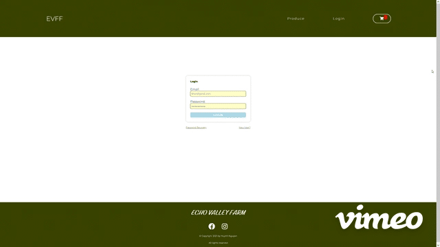

# Echo Valley Family Farm

As part of Coding Dojo requirements for graduation, each graduating student get to pick a personal/solo project using stack/stacks of their choice. Echo Valley Family Farm is coded using Java (Springboot, HTML, and CSS). EVFF is a startup business. Client's only requirement is that customers is able to purchase products from the farm and upon completion of checkout an email will be notified both owner and client for confirmation order confirmation. As a front-end developer I get to decide what the design the website will look like as this is a volunteer project. The final version of this project will be done via MERN stack. This is a preliminary design stage for this project. 

Design of this project is done using pure CSS including animation and hover effects. It is responsive to all viewport since its layout also done using CSS gride and flexbox. 

  
  
  

